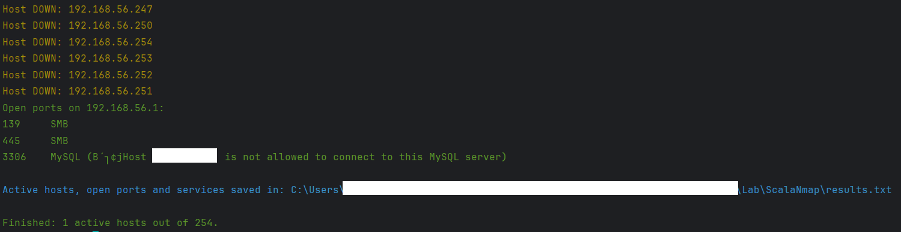

# 🌐 SCALAble Nmap
## 🧠 The first network mapper fully designed in Scala 🧠

# 📖 USAGE
- Open `sbt shell` or run it on Terminal with `run sbt` (suggested)
- Type:
  - `run <IP Address>` or `run <netID>/<CIDR>`
- Options:
  - `-h` to show usage hints (this option won't start the scan)
    - 💡 typing `run` without any IP or option, the usage hints will be shown 
  - `-open` to show open ports
  - `-serv` to show services running on open ports
  - `-os` to detect operating systems  
  - `-save` to save scan results on file
  - `-v` to turn on the verbose mode
  #### ---------Default options are all false---------

## ✅ Current features
- `Host status (UP or DOWN)` 
- `MAC address`
- `Hostname (reverse DNS lookup)`
- `Operating System`
- `TCP ports scan`
- `Running services on open ports`
- `Save results on .txt file`

###  🚧 Coming soon features...
- `More accurate service+version detection`
- `Vulnerable services`
- `Automatic anonymous FTP login`
- `UDP ports scan`
- `Save results on JSON file`

## 🔧 High scalability - how to add features
It's possible to add features easily, exploiting the functional nature of Scala. 
You have to open and modify these files:

### 📋 ResultsManager
- `case class Result(...)`
    - add your new feature
- `handleResults()`
    - add `handleXResults(config, host)`
- Create your new `handleXResults(config: Config, host: Result)` method
- `formatResults(...)`
    - add `builder.append(<your result>)`

### 🖥️ HostScanner
- `getScanResults(...)`
    - in `for...yield` cycle:
        - add `newResult <- <new method>` if it's a `Future`
        - or `newResult = <new method>` if it's an `Option`
    - update `Result(...)`

### 🛠️ Appropriate object
- Implement your new method